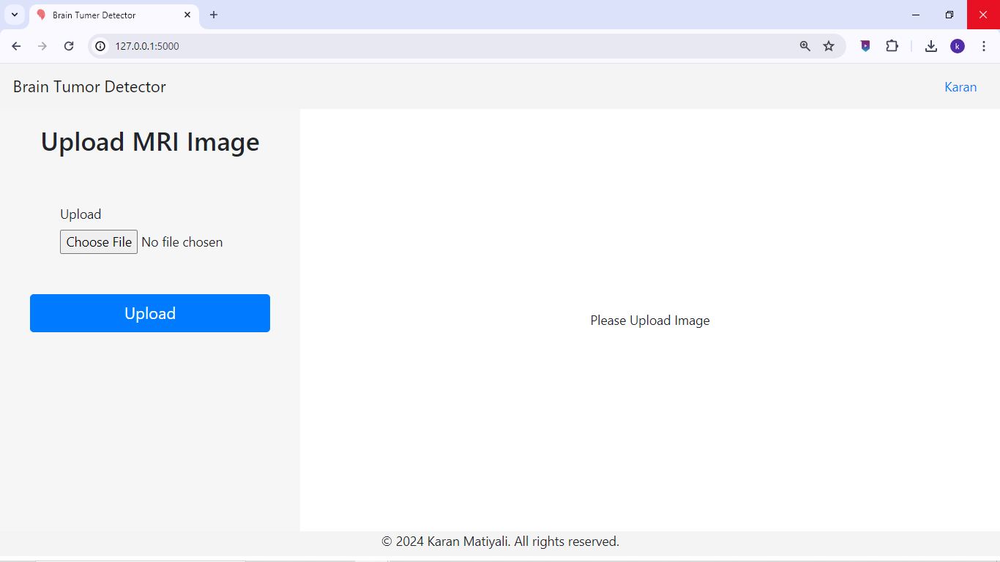
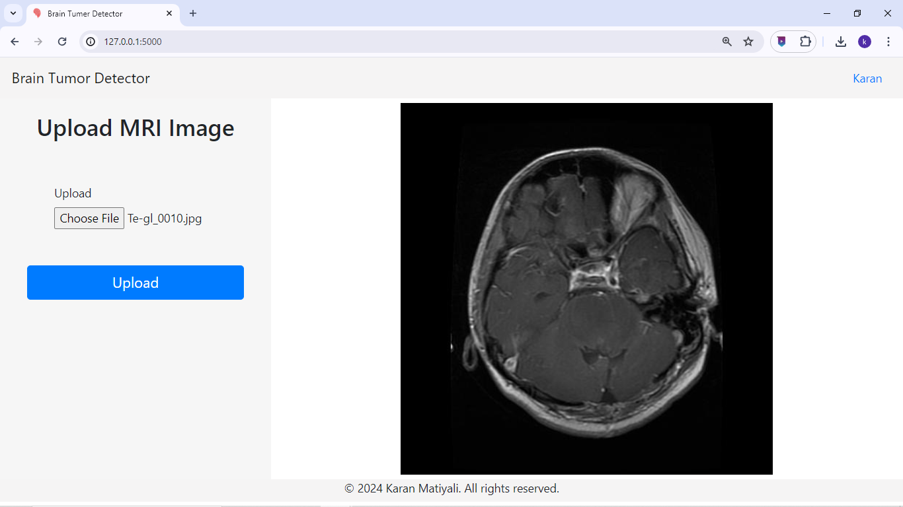
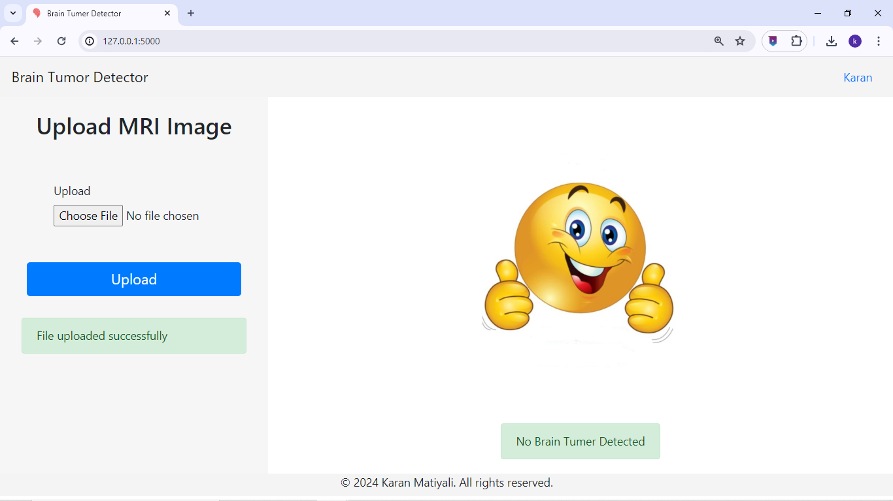
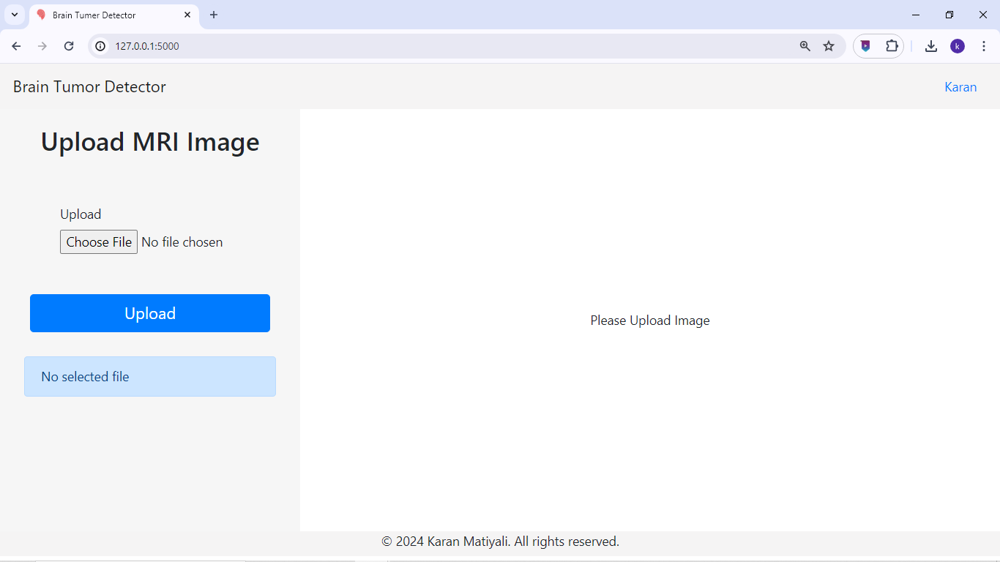

# Brain Tumor Detection Web App

This is a web application built using Flask for detecting brain tumors from MRI images.

## Features

- **Upload MRI Images**: Users can upload MRI images of the brain.
- **Tumor Detection**: The uploaded images are processed using a machine learning model to detect the presence of a brain tumor.
- **Display Results**: The application displays the prediction results to the user.

## Installation

1. Clone the repository:

    ```bash
    git clone https://github.com/crazykaran/brain-tumor-detection-app.git
    ```

2. Navigate to the project directory:

    ```bash
    cd brain-tumor-detection-app
    ```

3. Install and create virtual environment:

    ```bash
    pip install virtualenv
    virtualenv env
    .\env\Scripts\activate.ps1
    ```

4. Install the dependencies:

    ```bash
    pip install -r requirements.txt
    ```

## Usage

1. Start the Flask server:

    ```bash
    python app.py
    ```

2. Open your web browser and navigate to [http://localhost:5000](http://localhost:5000).

3. Upload an MRI image of the brain using the provided form.

4. Wait for the application to process the image and display the prediction results.

## File Structure

- `app.py`: Main Flask application file.
- `model/`: Directory containing the trained machine learning model.
- `static/`: Directory for static files (e.g., CSS, JavaScript, images).
- `templates/`: Directory for HTML templates.

## Dependencies

- Flask: Web framework for Python.
- Keras: Deep learning library.
- TensorFlow: Machine learning library.

## Contributing

Contributions are welcome! Please create a pull request with your changes.

## Screenshots

*Landing Page*

*Uploaded a image*

*Brain tumer detected*

*No Brain Tumer Detected*

*No file selected*


## Deployment
will be added soon